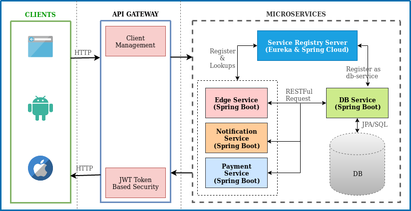

# Microservices with Spring | spring-microservice
A simple example of setting up a microservices system using Eureka, Spring Boot and Spring Cloud.

### Spring Microservice (spring-microservice) - Building blocks of Mecroservice:
1. Registry Server (registry-server) : This service will register every microservice and then the client microservice will look up the Eureka server to get a dependent microservice to get the job done. This Eureka Server is owned by Netflix and in this, Spring Cloud offers a declarative way to register and invoke services by Java annotation.
2. Edge Service (edge-service): It is a standalone web service to serve all CRUD type operations with the help of DB Service. Also, it will have fallback capabilities which prevent the client from receiving an HTTP error when the service is not available.
3. Payment Service (payment-service): This service is responsible to handle all the payment request/response. It is also connected with DB Service to update payment status with fallback capabilities.
4. Notification Service (notification-service): All the email/sms notification will be handle by this service. It is also connected with DB Service to update payment status with fallback capabilities.
4. DB Service (db-service): This service is directly connected with database (H2/MySQL). It's handle all DB operations.

##### Technical Stacks & dependencies other then Spring Boot & Java 8

- Actuator: features to help you monitor and manage your application
- EurekaDiscovery: for service registration
- JPA: to save/retrieve data
- H2: an in-memory database
- MySQL: Actual database driver
- RestRepositories: to expose JPA repositories as REST endpoints
- Web: Spring MVC and embedded Tomcat
- DevTools: to auto-reload the application when files change
- Lombok: to reduce boilerplate code
- Feign: a declarative web service client
- Zuul: provides intelligent routing
- Hystrix: a circuit breaker to stop cascading failure and enable resilience
